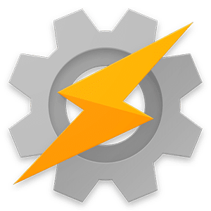
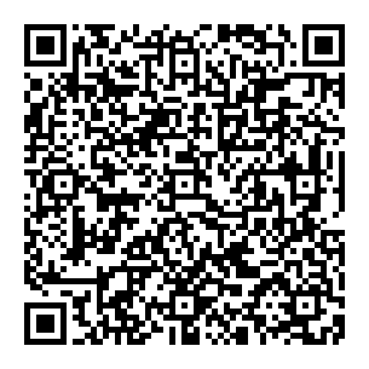

<center>



# F-Droid Repo Tasker
</center>
Unofficial F-Droid repository for the direct-purchase version of the Tasker app with automatic updates via github actions.

> [!WARNING]
> This is an unofficial repository and has nothing to do with Tasker's developer.

## Direct Purchase Version
The direct-purchase version does not rely on Google Play Store and can be activated using a licence key. you can buy a license from [here](https://taskernet.com/?licenses).

To add it to F-Droid simply click on [this link](https://raw.githubusercontent.com/oxcl/fdroid-repo-tasker/refs/heads/main/direct-purchase/fdroid/repo?fingerprint=363c64a0fda31fa5b1facebdda0a592d700918bb9b8bfb6a31d94c6dbc03956e).

or manually add the repo by copying the link below and adding it as an F-Droid repo.
```
https://raw.githubusercontent.com/oxcl/fdroid-repo-tasker/refs/heads/main/direct-purchase/fdroid/repo?fingerprint=363c64a0fda31fa5b1facebdda0a592d700918bb9b8bfb6a31d94c6dbc03956e
```

you can also scan the **QR Code**:
<center>

</center>

### Details
- Package Name: net.dinglisch.android.taskerm
- Version: 6.5.0-beta
- Version Code: 5413
- Last Update: Sat Mar  8 00:39:54 UTC 2025

## Google Play Version
You can also [buy Tasker from Google Play Store](https://play.google.com/store/apps/details?id=net.dinglisch.android.taskerm&hl=en).